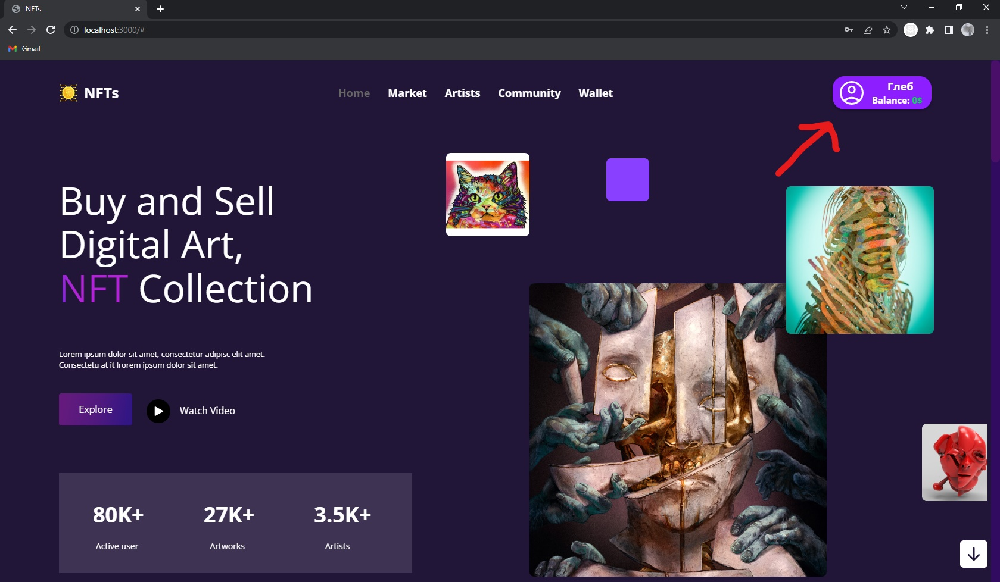
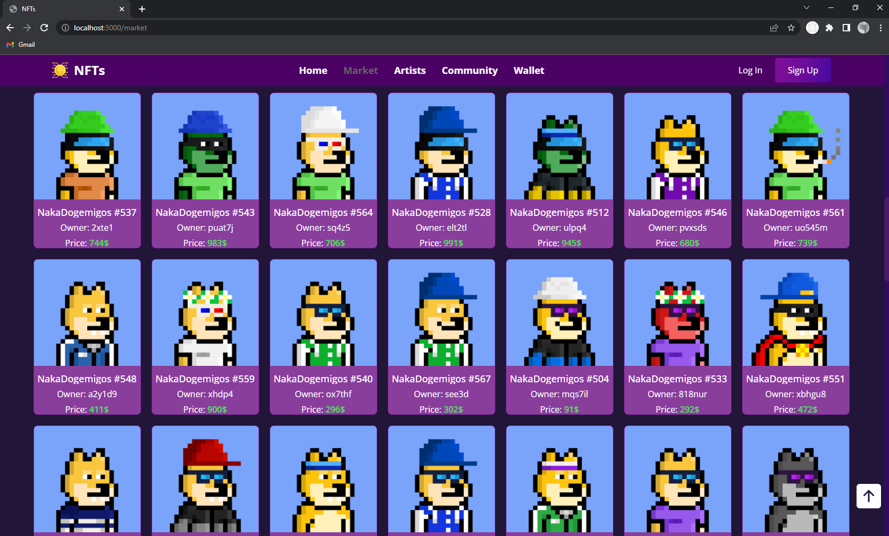

# launch website 

1) cd .\project-ts+react\
2) cd .\my-app\
3) npm i
4) npm start

# For the form to work correctly, you need to enter in the terminal

1) cd .\project-ts+react\
1) cd .\server\
2) npm i
3) node server

# For the correct operation of Nft, you need to enter in the terminal

1) cd .\project-ts+react\
2) cd .\server\
3) cd .\serverForm\
4) node serverform 

