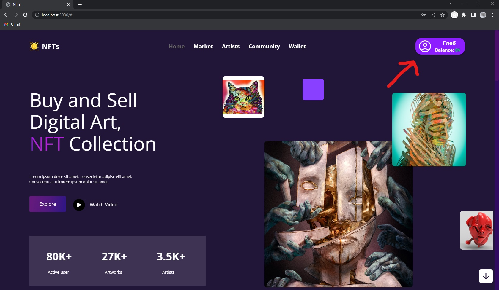
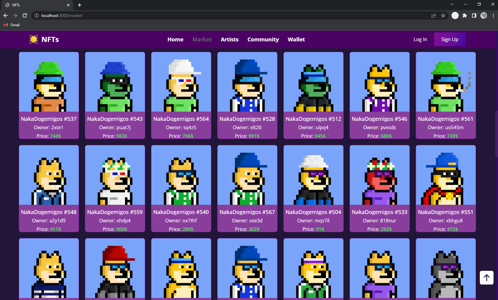

# For the form to work correctly, you need to enter in the terminal

1) npm i
2) cd .\server\
3) node server

# For the correct operation of Nft, you need to enter in the terminal

1) npm i
2) cd .\server\
3) cd .\serverForm\
4) node serverform 

